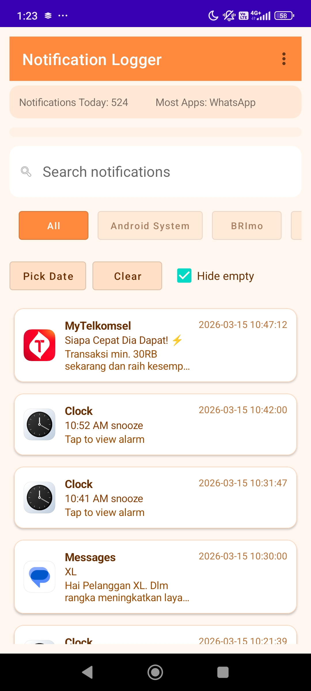
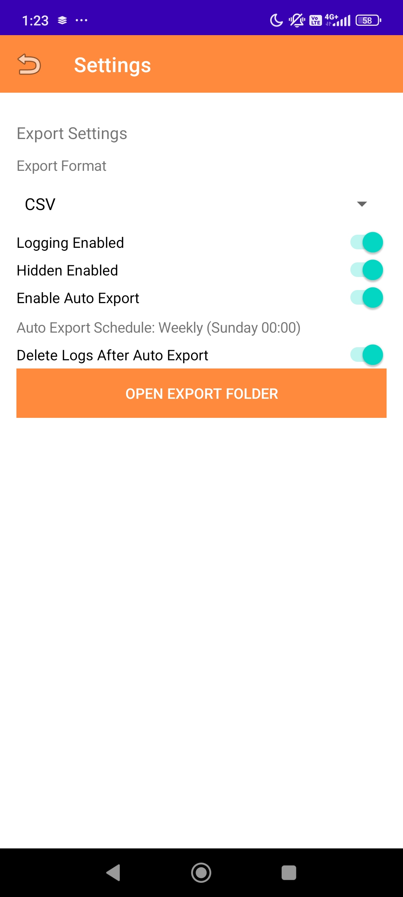
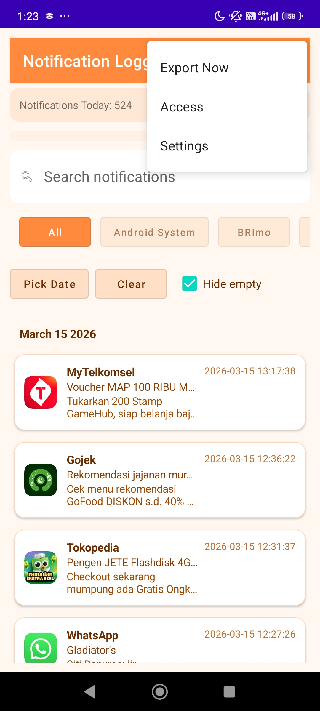

# Notification Logger

A lightweight, offline **notification history viewer** for Android. It listens to system notifications and stores them locally so you can search, filter by date, and export logs.

## Features
- Notification logging via `NotificationListenerService`
- Timeline view grouped by day
- Search (app name, package, title, message)
- Filter by app and date
- Hide/Show empty or hidden-content notifications
- CSV / JSON export
- Weekly auto export (Sunday 00:00)
- Swipe actions: copy or share a notification

## Controls (Main Screen)
- **Search bar**: live search across app name, package, title, and message
- **App chips**: filter by app package
- **Pick Date / Clear**: filter by specific day or reset to all
- **Hide empty**: hide notifications with empty/hidden content from the list
- **Swipe right**: copy notification summary
- **Swipe left**: share notification summary
- **Toolbar menu**:
  - **Export Now**: export current logs immediately
  - **Access**: open Notification Access settings
  - **Settings**: open app settings

## Controls (Settings)
- **Logging Enabled**: capture normal notifications
- **Hidden Enabled**: capture hidden-content notifications
- **Export Format**: CSV / JSON / CSV + JSON
- **Auto Export**: weekly export (Sunday 00:00)
- **Delete After Auto Export**: clear logs after scheduled export
- **Open Export Folder**: open the export directory

## Screenshots

## Setup
1. Clone the repository
2. Open in Android Studio
3. Build & run on device
4. Grant **Notification Access** when prompted

## Permissions
This app requires:
- **Notification access** to read system notifications

All logs are stored **locally on the device**. No data is uploaded.

## Export Location
Exports are saved to:
- `Documents/NotificationLogger/`

## Notes for MIUI / Xiaomi Devices
To ensure background logging works reliably:
- Enable **Autostart** for the app
- Set **Battery Saver** to **No restrictions**

## License
Choose a license for your project (MIT, Apache-2.0, etc.) and add it here.
